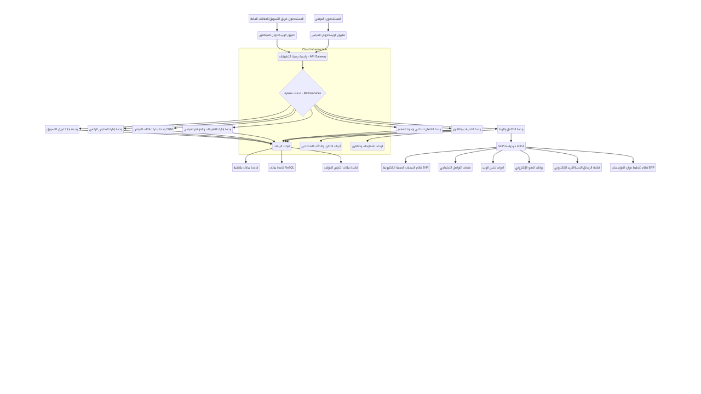

# المواصفات التقنية والبنية التحتية لنظام إدارة التسويق والعلاقات العامة

## 1. البنية المعمارية للنظام (System Architecture)

سيتم تصميم النظام بناءً على بنية الخدمات المصغرة (Microservices Architecture) لضمان المرونة، قابلية التوسع، وسهولة الصيانة. ستتكون كل وحدة من الوحدات المذكورة سابقاً (إدارة الفريق، إدارة المحتوى الرقمي، CRM، تطبيقات المرضى، التحليلات، التكامل، الاتصال الداخلي) من خدمة مصغرة مستقلة أو مجموعة من الخدمات المصغرة.

### مخطط بنية النظام

يوضح المخطط التالي البنية المعمارية المقترحة للنظام:

*   **الواجهة الأمامية (Frontend):**
    *   **تطبيق الويب:** سيتم تطويره باستخدام إطار عمل JavaScript حديث مثل React أو Angular أو Vue.js لتوفير تجربة مستخدم سريعة وتفاعلية.
    *   **تطبيق الجوال (للموظفين والمرضى):** سيتم تطويره باستخدام تقنيات هجينة (Hybrid) مثل React Native أو Flutter لدعم نظامي التشغيل iOS و Android من قاعدة كود واحدة، أو تطوير أصيل (Native) إذا كانت هناك متطلبات أداء عالية جداً.
*   **الواجهة الخلفية (Backend):**
    *   سيتم تطوير الخدمات المصغرة باستخدام لغات برمجة مثل Python (مع إطارات عمل مثل Django/Flask) أو Node.js (مع Express) أو Java (مع Spring Boot) أو .NET Core.
    *   سيتم استخدام واجهات برمجة التطبيقات (APIs) من نوع RESTful أو GraphQL للتواصل بين الخدمات المصغرة والواجهات الأمامية.
*   **قواعد البيانات (Databases):**
    *   **قواعد بيانات علائقية (Relational Databases):** مثل PostgreSQL أو MySQL لتخزين البيانات المنظمة (بيانات المستخدمين، المهام، المواعيد، بيانات المرضى الأساسية).
    *   **قواعد بيانات NoSQL:** مثل MongoDB أو Cassandra لتخزين البيانات غير المنظمة أو شبه المنظمة (مثل بيانات سجلات التفاعل، بيانات وسائل التواصل الاجتماعي، بيانات التحليلات الكبيرة).
    *   **قواعد بيانات ذاكرة التخزين المؤقت (Caching Databases):** مثل Redis لتحسين أداء النظام وتقليل الحمل على قواعد البيانات الرئيسية.

## 2. البنية التحتية للنشر (Deployment Infrastructure)

سيتم نشر النظام على بيئة سحابية (Cloud Environment) لضمان قابلية التوسع، التوافرية العالية، والأمان. يفضل استخدام أحد المزودين الرئيسيين مثل AWS (Amazon Web Services) أو Google Cloud Platform (GCP) أو Microsoft Azure.

*   **الحوسبة (Compute):**
    *   **الحاويات (Containers):** سيتم تغليف الخدمات المصغرة في حاويات Docker لضمان الاتساق بين بيئات التطوير والإنتاج.
    *   **إدارة الحاويات (Container Orchestration):** سيتم استخدام Kubernetes لإدارة ونشر وتوسيع نطاق الحاويات تلقائياً.
*   **الشبكات (Networking):**
    *   **شبكة افتراضية خاصة (VPC):** لإنشاء بيئة شبكة معزولة وآمنة داخل السحابة.
    *   **موازنات التحميل (Load Balancers):** لتوزيع حركة المرور على مثيلات الخدمات المختلفة لضمان التوافرية العالية والأداء.
    *   **جدران الحماية (Firewalls) ومجموعات الأمان (Security Groups):** للتحكم في الوصول إلى موارد الشبكة.
*   **التخزين (Storage):**
    *   **تخزين الكتل (Block Storage):** للأقراص الثابتة الافتراضية لقواعد البيانات والخوادم.
    *   **تخزين الكائنات (Object Storage):** مثل Amazon S3 أو Google Cloud Storage لتخزين الملفات الكبيرة (الصور، الفيديوهات، الوثائق) بشكل فعال من حيث التكلفة وقابلية التوسع.
*   **خدمات إضافية:**
    *   **خدمات إدارة الهوية والوصول (IAM):** لإدارة صلاحيات المستخدمين والخدمات.
    *   **خدمات المراقبة والتسجيل (Monitoring & Logging):** لجمع السجلات ومراقبة أداء النظام (مثل Prometheus, Grafana, ELK Stack).
    *   **خدمات الرسائل (Messaging Queues):** مثل Apache Kafka أو RabbitMQ للتواصل غير المتزامن بين الخدمات المصغرة.

## 3. الأمان (Security)

سيتم تطبيق أفضل الممارسات الأمنية على جميع مستويات النظام:

*   **أمان البيانات:** تشفير البيانات في حالة السكون (Data at Rest) وفي حالة النقل (Data in Transit) باستخدام بروتوكولات مثل TLS/SSL.
*   **المصادقة والتفويض (Authentication & Authorization):** استخدام معايير صناعية مثل OAuth2 و OpenID Connect لإدارة وصول المستخدمين. تطبيق مبدأ أقل الامتيازات (Principle of Least Privilege).
*   **فحص الثغرات الأمنية:** إجراء فحوصات أمنية دورية واختبارات اختراق (Penetration Testing).
*   **الامتثال (Compliance):** الالتزام باللوائح والمعايير الخاصة بالرعاية الصحية وحماية البيانات (مثل HIPAA، GDPR، اللوائح المحلية).

## 4. قابلية التوسع والأداء (Scalability & Performance)

*   **التوسع الأفقي (Horizontal Scaling):** تصميم الخدمات المصغرة لتكون عديمة الحالة (Stateless) لتمكين إضافة أو إزالة مثيلات الخدمات بسهولة.
*   **التخزين المؤقت (Caching):** استخدام طبقات التخزين المؤقت على مستوى التطبيق وقاعدة البيانات لتحسين أوقات الاستجابة.
*   **تحسين قواعد البيانات:** فهرسة البيانات بشكل فعال، وتحسين الاستعلامات.
*   **شبكة توصيل المحتوى (CDN):** لتسريع تسليم المحتوى الثابت (الصور، ملفات CSS/JS) للمستخدمين حول العالم.

## 5. أدوات التطوير والعمليات (DevOps Tools)

*   **نظام التحكم في الإصدارات (Version Control System):** Git (مع GitHub/GitLab/Bitbucket).
*   **خط أنابيب التكامل المستمر والنشر المستمر (CI/CD Pipeline):** Jenkins, GitLab CI, GitHub Actions, CircleCI لأتمتة عمليات بناء واختبار ونشر الكود.
*   **إدارة التكوين (Configuration Management):** Ansible, Terraform لإدارة البنية التحتية ككود (Infrastructure as Code).

## 6. لغات البرمجة وإطارات العمل المقترحة (أمثلة)

*   **الواجهة الأمامية للويب:** React.js / Next.js
*   **الواجهة الأمامية للجوال:** React Native / Flutter
*   **الواجهة الخلفية:** Python (Django/FastAPI) أو Node.js (NestJS)
*   **قواعد البيانات:** PostgreSQL (للمعلومات المنظمة)، MongoDB (للمعلومات غير المنظمة)
*   **التخزين المؤقت:** Redis
*   **خدمات الرسائل:** RabbitMQ

## 7. متطلبات الأجهزة والبرمجيات (Hardware & Software Requirements)

سيتم تحديد المتطلبات الدقيقة للأجهزة والبرمجيات بناءً على حجم البيانات المتوقع، عدد المستخدمين، وحجم حركة المرور. ومع ذلك، فإن استخدام البنية السحابية يتيح مرونة كبيرة في تخصيص الموارد وتوسيعها حسب الحاجة دون الحاجة إلى تحديد مسبق دقيق للأجهزة المادية.
